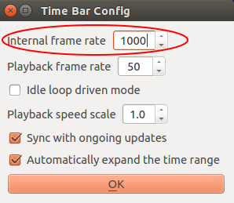
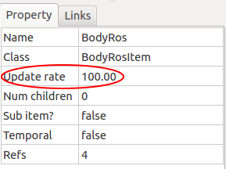
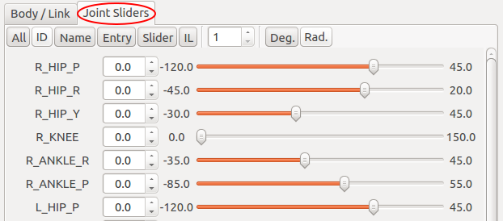

==========================
Information for developers
==========================

本章では、Choreonoid ROS プラグイン、Gazebo ROS プラグインからの移植に関する内容を記載します。

本章は、C++ および CMake での開発経験、Choreonoid プラグインの実装方法、ROS API、Gazebo ROS packages について概ね理解している事が前提条件となります。

Choreonoid プラグインの実装方法、ROS API、Gazebo ROS packages の詳細については、以下の URL を参照してください。

* Choreonoid - Plugin development:

  http://choreonoid.org/ja/manuals/latest/plugin-development/index.html

* ROS API:

  http://wiki.ros.org/APIs

  http://docs.ros.org/api/roscpp/html

* Gazebo ROS packages (source code):

  https://github.com/ros-simulation/gazebo_ros_pkgs.git

* Gazebo - Connect to ROS tutorial:

  http://gazebosim.org/tutorials?cat=connect_ros

本章の説明は、特に断りが無い限り Choreonoid ROS プラグイン本体のソースコード (choreonoid_ros_pkg/choreonoid_plugins/src 以下) を元とした記載となります。

説明で使用するソースコードは、Appendix に全て省略の無い状態で載せています。
必要に応じて参照してください。

なお、説明はいずれも 2017/03/20 時点の内容に基づくものとなります。

Choreonoid ROS plguin
=====================

この節では、Choreonoid ROS プラグインについて説明します。

既存の実装について説明することで、機能拡張を実施する際に必要な情報を提供する事および、類似のプラグインを実装する際の参考情報を提供する事を主旨としています。

なお、コントローラとコントローラに属さないものを、それぞれの項として記載しています。

これは、Choreonoid ROS プラグインが、ロボットに属する処理 (センサ処理や関節制御など) をコントローラ、シミュレーション環境に属する処理 (シミュレーションの制御やワールド内の情報提供など) をコントローラでないものとして実装している事によります。

Implement a controller
----------------------

コントローラの実装について、Choreonoid ROS プラグインの BodyRosItem の実装を元に説明します。

BodyRosItem が提供する機能については、:ref:`manual_ros_topics` の注釈を参照してください。

Derive the base class
^^^^^^^^^^^^^^^^^^^^^

Choreonoid フレームワーク上でコントローラを実装するためのクラスとして用意された ControllerItem クラスを基底クラスとします。

.. literalinclude:: sources/BodyRosItem.h
   :lines: 30
   :language: cpp
   :lineno-match:
   :caption: BodyRosItem.h - Class definition

.. note::

   同じ用途を持つクラスとして、ControllerItem クラスとは別に SimpleControllerItem クラスも用意されていますが、Choreonoid ROS プラグインでは使用していないため、説明は割愛します。

Implement initialize()
^^^^^^^^^^^^^^^^^^^^^^

初回実行時のみの処理
""""""""""""""""""""

初回実行時のみ必要な処理は static 関数として実装し、後述するプラグイン本体の初期化処理において呼び出すようにします。

.. literalinclude:: sources/BodyRosItem.h
   :lines: 32 - 33
   :language: cpp
   :lineno-match:
   :caption: BodyRosItem.h - Prototype definition of initialize()

.. literalinclude:: sources/BodyRosItem.cpp
   :lines: 11 - 22
   :emphasize-lines: 5 - 6, 8 - 9 
   :language: cpp
   :lineno-match:
   :caption: BodyRosItem::initialize()

15 行目および 16 行目は ROS の初期化処理です。

当該処理は、プロセス内で複数回実行すると問題が生じるため、ros::isInitialized で実行の確認を実施し、重複実行を防止します。

.. literalinclude:: sources/BodyRosItem.cpp
   :lines: 15 - 16
   :language: cpp
   :lineno-match:
   :caption: BodyRosItem.cpp - ROS initialization

18 行目および 19 行目は、BodyRosItem を Choreonoid へ登録する処理です。

こちらも複数回実行すると問題が生じるため、重複実行を防止します。

.. literalinclude:: sources/BodyRosItem.cpp
   :lines: 18 - 19
   :language: cpp
   :lineno-match:
   :caption: BodyRosItem.cpp - Register BodyRosItem class

シミュレーション開始時の処理
""""""""""""""""""""""""""""

シミュレーション開始時に実行する必要がある処理は ControllerItem の start() 仮想関数を実装します。

start() はシミュレーションの開始と同期して実行されます。

.. literalinclude:: sources/BodyRosItem.h
   :lines: 40 - 47
   :emphasize-lines: 1
   :language: cpp
   :lineno-match:
   :caption: BodyRosItem - Prototype definition of start()

start() には、各トピックでパブリッシュするメッセージの初期化処理、トピックをパブリッシュする為のインスタンス (パブリッシャー) の生成処理、ROS ノードの生成および起動処理を実装します。

.. literalinclude:: sources/BodyRosItem.cpp
   :lines: 68 - 114
   :emphasize-lines: 16 - 31, 33 - 36, 38, 43 - 44
   :language: cpp
   :lineno-match:
   :caption: BodyRosItem::start()

以下、ソースコードのハイライト箇所について順に説明します。

80 行目から 92 行目までは、ロボットの関節に関する情報をパブリッシュするメッセージの初期化処理です。

現行の Choreonoid ではシミュレーション実行中にモデルの構造が動的に変更される事は無いため、ここで対象モデルの関節数に合わせてデータのサイズを変更し、関節名、関節角度、関節角速度、トルク値を初期値として設定します。

取得した情報のパブリッシュ処理については「Implement control()」で説明します。

.. literalinclude:: sources/BodyRosItem.cpp
   :lines: 80 - 92
   :language: cpp
   :lineno-match:
   :caption: BodyRosItem::start() - initialize joint_state

100 行目から 102 行目は ROS ノードの生成、105 行目は ROS トピックの登録処理です。
103 行目の createSensors については説明が長くなるため後述します。

ros::NodeHnadler の引数に name (モデルの名前) を渡しています。
これにより生成したノードの名前は、モデルの名前となります。
また、ROS の仕様において、名前空間の文字列で - が使用できないため、std::replace で - を \_ に置換します。

ノードの名前は、名前空間の親の名前となります。
このノードに対して生成したトピックやサービスは、親の名前空間に属するものとなります。
ただし、トピックやサービスの名前を / で開始した場合は、この限りではありません。

105 行目の場合、トピックは /[model name]/joint_states で提供されます。

.. literalinclude:: sources/BodyRosItem.cpp
   :lines: 100 - 105
   :emphasize-lines: 1 - 3, 6
   :language: cpp
   :lineno-match:
   :caption: BodyRosItem::start() - Create a ROS node and publishers

110 行目および 111 行目は、ROS のイベントループ開始処理です。

使用するスレッドの数を明示的に指定する場合は、ros::AsyncSpinner の引数にスレッド数を指定します。

明示的にスレッドの数を指定する必要が無い場合は、0 を指定すると ROS API 側で CPU の数に応じたスレッドが自動的に設定されます。

.. literalinclude:: sources/BodyRosItem.cpp
   :lines: 110 - 111
   :language: cpp
   :lineno-match:
   :caption: BodyRosItem::start() - Start ROS spinner

以下、103 行目の createSensors() について説明します。

createSensors は、このコントローラアイテムの親アイテム (BodyItem) が装備するセンサデバイスを取得し、各デバイスに対応するトピックのパブリッシャーの生成処理を実行します。

基本的に、引数で渡した body の devices を呼び出しセンサデバイスを取得、対応するセンサデバイスが存在する場合、それらのパブリッシャーを生成するといった処理の流れとなります。

.. literalinclude:: sources/BodyRosItem.cpp
   :lines: 116 - 133
   :emphasize-lines: 3, 10 - 15
   :language: cpp
   :lineno-match:
   :caption: BodyRosItem::createSensor() - Create publishers for force sensor devices

ロボットの関節に関する情報をパブリッシュする場合とは異なり、センサデバイスについては、デバイスの更新に同期したイベントシグナルが発行されるため、パブリッシュ処理を当該イベントシグナルに接続しデータ更新のタイミングでパブリッシュを実行するようにします。

.. literalinclude:: sources/BodyRosItem.cpp
   :lines: 129 - 130
   :language: cpp
   :lineno-match:
   :caption: BodyRosItem::createSensor() - sigStateChanged

connect の引数で渡している BodyRosItem::updateForceSensor が、パブリッシュ処理の本体です。

パブリッシュするメッセージ (ここでは geomerty_mesg::Wrench) にセンサのデータをコピーし、当該メッセージをパブリッシュする実装です。

この実装ではデータのコピーのみですが、データの変換処理やデータのチェック処理が必要な場合、ここへそれらの実装を追加します。

.. literalinclude:: sources/BodyRosItem.cpp
   :lines: 206 - 216
   :language: cpp
   :lineno-match:
   :caption: BodyRosItem::updateForceSensor()

シミュレーション停止時の処理
""""""""""""""""""""""""""""

シミュレーション停止時に実行する必要がある処理は ControllerItem の stop() 仮想関数を実装します。
stop() はシミュレーションの停止に同期して実行されます。

.. literalinclude:: sources/BodyRosItem.h
   :lines: 40 - 47
   :emphasize-lines: 8
   :language: cpp
   :lineno-match:
   :caption: BodyRosItem - Prototype definition of stop()

stop() には、トピックの停止処理 (stop_publish)、ROS ノードの停止処理を実装します。

また、終了時に開放処理が必要なもの等についても、ここに実装します。

.. literalinclude:: sources/BodyRosItem.cpp
   :lines: 396 - 411
   :emphasize-lines: 4
   :language: cpp
   :lineno-match:
   :caption: BodyRosItem::stop

.. literalinclude:: sources/BodyRosItem.cpp
   :lines: 365 - 394
   :language: cpp
   :lineno-match:
   :caption: BodyRosItem::stop_publish

Implement control()
^^^^^^^^^^^^^^^^^^^

制御処理は、ControllerItem の control() 仮想関数を実装することで実現します。

.. literalinclude:: sources/BodyRosItem.h
   :lines: 44 - 47
   :emphasize-lines: 2
   :language: cpp
   :lineno-match:
   :caption: BodyRosItem - Prototype definition of control()

control() は、シミュレーションの実行周期で呼びされます。
シミュレーションの実行周期は、Choreonoid のタイムバーの設定で指定した周期となります。
以下の設定の場合、1ms 周期で control が呼び出されます。

BodyRosItem では、control でロボットの関節に関する情報のパブリッシュ処理を実行しています。

currentTime で現在のシミュレーション時間を取得し、パブリッシュの出力周期毎 (デフォルト値 10ms) に、関節角度、関節角速度、トルク値をコピーしパブリッシュ処理を実行します。

関節名 (joint->name()) については、先に説明した通りシミュレーション中に変更が発生しないため、コピー対象外としています。

なお、ここでは返り値を常に true としていますが、制御処理において動作に支障をきたすような状態となった場合は、false を返す事で、当該コントローラの動作を停止する事が可能です。

.. literalinclude:: sources/BodyRosItem.cpp
   :lines: 182 - 204
   :language: cpp
   :lineno-match:
   :caption: BodyRosItem::control()

Implement a other than controller
---------------------------------

コントローラ以外の実装について、Choreonoid ROS プラグインの WorldRosItem の実装を元に説明を記載します。

WorldRosItem が提供する機能については、:ref:`manual_ros_topics` の注釈を参照してください。

Decide to base class
^^^^^^^^^^^^^^^^^^^^

Choreonoid フレームワーク上で共有されるオブジェクトを実装するためのクラスとして用意された Item クラスを基底クラスとします。

.. literalinclude:: sources/WorldRosItem.h
   :lines: 72
   :language: cpp
   :lineno-match:
   :caption: WorldRosItem - Class definition

Implement processing of initialize
^^^^^^^^^^^^^^^^^^^^^^^^^^^^^^^^^^

初回実行時のみの処理
""""""""""""""""""""

初回実行時のみ必要な処理の実装は、Implement a controller の Implement initialize() と同様ですので、そちらを参照してください。

.. literalinclude:: sources/WorldRosItem.cpp
   :lines: 28 - 40
   :emphasize-lines: 9 - 10
   :language: cpp
   :lineno-match:
   :caption: WorldRosItem::initialize()

シミュレーション開始・終了時の処理
""""""""""""""""""""""""""""""""""

シミュレーション開始・終了時の処理について、Item クラスは ControllerItem クラスと違い、シミュレーション開始・終了時に呼び出される関数が存在しないため、同様の機能を実現するための実装が必要となります。

WorldRosItem の実装では、これを SimulatorItem クラスの機能である sigSimulationStarted イベントシグナル (シミュレーション開始時) および、sigSimulationFinished イベントシグナル (シミュレーション終了時) に、開始・終了処理をそれぞれ接続することで実現しています。

.. literalinclude:: sources/WorldRosItem.cpp
   :lines: 241 - 268
   :emphasize-lines: 17 - 18
   :language: cpp
   :lineno-match:
   :caption: WorldRosItem - signal connections

接続している関数が ControllerItem 使用の場合と同名の start() および stop() となっていますが、こちらは WorldRosItem で宣言した関数である事に留意してください。

.. literalinclude:: sources/WorldRosItem.h
   :lines: 72 - 85
   :emphasize-lines: 13 - 14
   :language: cpp
   :lineno-match:
   :caption: WorldRosItem - prototype definitions of start() and stop()

開始処理である WorldRosItem::start() は、ControllerItem の場合と同様に ROS ノードの生成および、ROS トピックの登録処理を実装します。

.. literalinclude:: sources/WorldRosItem.cpp
   :lines: 273 - 290
   :emphasize-lines: 12, 15
   :language: cpp
   :lineno-match:
   :caption: WorldRosItem::start()

終了処理である WorldRosItem::stop() も、ControllerItem の場合と同様に ROS トピックの停止処理および ROS ノードの停止処理を実装します。

.. literalinclude:: sources/WorldRosItem.cpp
   :lines: 600 - 619
   :emphasize-lines: 14, 18
   :language: cpp
   :lineno-match:
   :caption: WorldRosItem::stop()

Implement processing of publish
^^^^^^^^^^^^^^^^^^^^^^^^^^^^^^^

パブリッシュ処理についても、Item クラスには、ControllerItem の control() に相当する関数が存在しないため、こちらもシミュレーション開始・終了処理と同様に、機能を実現するための実装が必要となります。

WorldRosItem の実装では、SimulatorItem クラスの機能である、シミュレーション処理と同期して任意の関数を実行する機能 (フック) へ、パブリッシュ処理の関数を登録する事で実現しています。

.. literalinclude:: sources/WorldRosItem.cpp
   :lines: 273 - 293
   :emphasize-lines: 20
   :language: cpp
   :lineno-match:
   :caption: WorldRosItem::start() - addPostDynamicsFunction 

ここでは addPostDynamicsFunction を使用していますが、シミュレーション処理内 (SimulatorItem::stepSimulation()) で実行されるタイミングに応じて 3 種類のフックが用意されていますので、用途に応じて使い分ける事が可能です。

用意されているフックとその実行タイミングは以下の通りです。

+---------------------------+----------------------------+--------------------+
| フック                    | コントローラ実行           | 物理演算処理の実行 |
|                           +-------------+--------------+                    |
|                           | Immeidate   | 非 Immediate |                    |
+===========================+=============+==============+====================+
| addPreDynamicsFunction    | Not yet     | Not yet      | Not yet            |
+---------------------------+-------------+--------------+--------------------+
| addMidDynamicsFunction    | Done        | Not yet      | Not yet            |
+---------------------------+-------------+--------------+--------------------+
| addPostDynamicsFunction   | Done        | Not yet      | Done               |
+---------------------------+-------------+--------------+--------------------+

パブリッシュ処理の本体は WorldRosItem::publishClock() です。

ユーザ指定の周期毎にシミュレーション時間をパブリッシュする実装です。

.. literalinclude:: sources/WorldRosItem.cpp
   :lines: 396 - 409
   :emphasize-lines: 3, 9
   :language: cpp
   :lineno-match:
   :caption: WorldRosItem::publishClock()

WorldRosItem は、シミレーション開始時にフックの登録を実行する実装となっているため、シミュレーション停止時にフックの解除を実装します。

フックの解除に用いる関数は、フックの add を remove に置き換えた関数を使用します。

.. literalinclude:: sources/WorldRosItem.cpp
   :lines: 600 - 605
   :emphasize-lines: 4
   :language: cpp
   :lineno-match:
   :caption: WorldRosItem::stop() - removePostDynamicsFunction()

Common matters
--------------

ここでは実装した機能をプラグインとして動作させる手順を説明します。

If you adds new feature in this plugin
^^^^^^^^^^^^^^^^^^^^^^^^^^^^^^^^^^^^^^

Choreonoid ROS プラグイン本体へ機能を追加するにあたり、ソースファイルを新規に作成した場合、当該ソースファイルを choreonoid_ros_pkg/choreonoid_plugins/CMakeLists.txt の add_cnoid_plugin に追加しビルド対象とする必要があります。

.. literalinclude:: sources/CMakeLists.txt
   :lines: 195 - 204
   :language: cmake
   :lineno-match:
   :caption: choreonoid_plugins/CMakeLists.txt

また、Choreonoid ROS プラグイン本体へ機能を追加した場合、RosBodyPlugin::initialize() へ実装したクラスの initialize() 呼び出しを追加する必要があります。

.. literalinclude:: sources/RosBodyPlugin.cpp
   :lines: 19 - 25
   :language: cpp
   :lineno-match:
   :caption: RosBodyPlugin::initialize()

これらの対応がなされていない場合、追加した機能は有効になりません。

Definition of plugin entry
^^^^^^^^^^^^^^^^^^^^^^^^^^

プラグインエントリの定義は RosBodyPlugin.cpp にあります。
この定義は変更しないでください。

.. literalinclude:: sources/RosBodyPlugin.cpp
   :lines: 28
   :language: cpp
   :lineno-match:
   :caption: RosBodyPlugin - Plugin entry

Others
------

Copy a header file not installed
^^^^^^^^^^^^^^^^^^^^^^^^^^^^^^^^

Choreonoid のヘッダファイルの中には、インストール対象外となっているものが存在します。

プラグインの実装において、これらのヘッダファイルを必要とする状況となった場合、choreonoid_ros/CMakeLists.txt で install を使用し対応する事が可能です。

.. literalinclude:: sources/choreonoid_ros/CMakeLists.txt
   :lines: 38 - 
   :emphasize-lines: 23 - 26
   :language: cmake
   :lineno-match:
   :caption: choreonoid_ros/CMakeLists.txt - Parts

本項は、所謂バッドノウハウと呼ばれるものであり、Choreonoid ROS プラグインの Choreonoid に限定した内容である事に留意してください。

Input() and output() in ControllerItem class
^^^^^^^^^^^^^^^^^^^^^^^^^^^^^^^^^^^^^^^^^^^^

Choreonoid ROS プラグインでは使用していませんが、制御処理において、入力処理、制御処理、出力処理の流れで処理を実装する場合は、ControllerItem の input() および output() 仮想関数を実装する事で実現可能です。

簡単な処理である場合を除き、input()、control()、output() それぞれの実装で制御処理を実現する事を推奨します。

Porting Gazebo ROS plguin
=========================

この節では、Gazebo ROS プラグインからの移植について記載します。

本節の内容は、前節の説明を理解している事が前提となります。

Initialization
--------------

Porting initialization functions of Gazebo plugin
^^^^^^^^^^^^^^^^^^^^^^^^^^^^^^^^^^^^^^^^^^^^^^^^^

Gazebo ROS プラグインの実装において、初期化に関する処理は基本的に Load()、Init()、Reset() をオーバーライドした関数、コンストラクタで実行する実装となっています。

よって、移植の際は、これらの実装を前節で述べた initialize()、start()、コンストラクタへ適切に実装する事で、同等の機能を実現できます。

Initial potures of models
^^^^^^^^^^^^^^^^^^^^^^^^^

Gazebo ROS プラグインの実装において、モデルの初期姿勢を設定する処理については、start() への実装による設定ではなく Choreonoid のユーザ・インタフェース「関節スライダ」で初期姿勢を設定したプロジェクトを使用する事を推奨します。

Properties in the urdf or xacro files
^^^^^^^^^^^^^^^^^^^^^^^^^^^^^^^^^^^^^

現行の Choreonoid ROS プラグインでは、urdf ファイルや xacro ファイル内のプロパティによる設定をサポートしていません。

よって、Gazebo ROS プラグインの初期化に関する処理において、当該プロパティを使用している場合、以下のいずれかの実装で置き換える必要があります。

- Choreonoid のプロパティとして実装する

- `YAML による追加情報ファイル <http://choreonoid.org/ja/manuals/latest/handling-models/modelfile/modelfile-yaml.html>`_ を用意し start でこの情報を使用する

Finalization
------------

Gazebo ROS プラグインの実装において、デストラクタで実装している停止処理については、Choreonoid ROS プラグインでは、前節で説明した stop() へ実装するようにしてください。

Choreonoid ROS プラグインのデストラクタへは、Choreonoid 終了時に実行する処理のみを実装するようにしてください。

Implement control()
-------------------

Gazebo ROS プラグインの実装において、コントローラは基本的に `Gazebo のイベント <http://osrf-distributions.s3.amazonaws.com/gazebo/api/dev/group__gazebo__event.html>`_ (例えば Events::ConnectWorldUpdateBigin 等) に、コントローラの処理を実装した関数を割り当てる実装となっています。

具体例としては、 `GazeboRosTemplate クラス <https://github.com/ros-simulation/gazebo_ros_pkgs/blob/kinetic-devel/gazebo_plugins/src/gazebo_ros_template.cpp>`_ の場合、UpdateChild() がコントローラの処理を実装した関数となります。

移植の際は、この実装を前節で述べた control() に実装する事で同等の機能を実現できます。

Porting functions
-----------------

関数の移植については、 `Choreonoid が必要とするライブラリ <http://choreonoid.org/ja/manuals/latest/install/build-ubuntu.html#id5>`_ と競合するライブラリを使用している場合、これを回避するための修正もしくは改修が必須となります。
また、状況によっては移植不可能となる場合もあるため、移植に際し事前に確認する事を推奨します。

また、 `Gazebo の Quarternion <http://osrf-distributions.s3.amazonaws.com/gazebo/api/dev/classgazebo_1_1math_1_1Quaternion.html>`_ や `ROS の Vector3 <http://docs.ros.org/api/tf/html/c++/classtf_1_1Vector3.html>`_ を使用している場合、cnoid::Quaternion や cnoid::Vector3 と区別するため名前空間を正確に指定する必要があります。

Logging and notifications to users
----------------------------------

ROS のストリーム出力 (ROS_INFO 等) は、そのままの使用で問題ありません。
Choreonoid ROS プラグインでも随所で使用しています。

Gazebo のストリーム出力 (gzmsg 等) については、特に理由が無ければ ROS のストリーム出力もしくは、C++ のストリーム出力への使用変更を推奨します。

Choreonoid を使用しているユーザに対するメッセージを出力する場合は、MessageView クラスを使用します。

以下のコードは、Choreonoid のメッセージビューに「An error ocurred in controller」を出力する例となります。

.. code-block:: cpp

   MessageView::instance()->putln(MessageView::ERROR, boost::format("An error ocurred in controller"));

Appendix
========

本章の説明で使用したソースコードを添付します。

BodyRosItem.h
-------------

.. literalinclude:: sources/BodyRosItem.h
   :language: cpp
   :lineno-match:
   :caption: BodyRosItem.h

BodyRosItem.cpp
---------------

.. literalinclude:: sources/BodyRosItem.cpp
   :language: cpp
   :lineno-match:
   :caption: choreonoid_ros_pkg/choreonoid_plugins/src/BodyRosItem.cpp

WorldRosItem.h
--------------

.. literalinclude:: sources/WorldRosItem.h
   :language: cpp
   :lineno-match:
   :caption: choreonoid_ros_pkg/choreonoid_plugins/src/WorldRosItem.h

WorldRosItem.cpp
----------------

.. literalinclude:: sources/WorldRosItem.cpp
   :language: cpp
   :lineno-match:
   :caption: choreonoid_ros_pkg/choreonoid_plugins/src/WorldRosItem.cpp

RosBodyPlugin.cpp
-----------------

.. literalinclude:: sources/RosBodyPlugin.cpp
   :language: cpp
   :lineno-match:
   :caption: choreonoid_ros_pkg/choreonoid_plugins/src/RosBodyPlugin.cpp

CMakeLists.txt
--------------

.. literalinclude:: sources/CMakeLists.txt
   :language: cmake
   :lineno-match:
   :caption: choreonoid_ros_pkg/choreonoid_plugins/CMakeLists.txt

