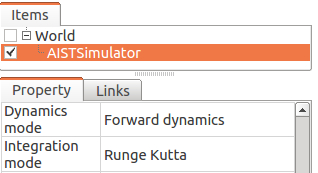
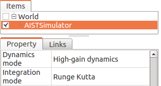
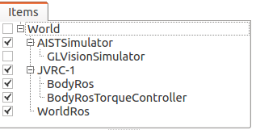
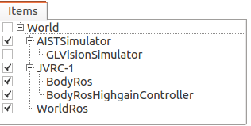

================================
 Choreonoid ROS Plugin Tutorial
================================

Run preconfigured project
=========================

You can use preconfigured project prepared for this tutorial.

.. code-block:: bash
   
   $ roslaunch choreonoid_ros jvrc-1-rviz.launch

You should see the JVRC O1 task loaded on Choreonoid with rviz visualization.

.. image:: choreonoid-rviz.png

.. note::

   Preconfigured project has been created in the Foward dynamics mode.

Use ROS utility commands to monitor the message
===============================================

List available topics:

.. code-block:: bash
   
   $ rostopic list

Print input of force sensor:
   
.. code-block:: bash

   $ rostopic echo /JVRC_1/lfsensor

Display camera input (using image-view package):

.. code-block:: bash
   
   $ sudo apt-get install ros-$ROS_DISTRO-image-view
   $ rosrun image_view image_view image:=/JVRC_1/rcamera/image_raw

Use ROS utility commands to control the simulation
==================================================

Pause the simulation:

.. code-block:: bash

   $ rosservice call /choreonoid/pause_physics

Continue the paused simulation:
   
.. code-block:: bash

   $ rosservice call /choreonoid/unpause_physics

Use Python script to send command to the robot
==============================================

Following example (test-torque-control-jvrc1.py) sends each trajectory commands to any joint of JVRC-1 robot.

.. literalinclude:: test-torque-control-jvrc1.py
   :language: python

The script contains under directory of ~/catkin_ws/install/share/choreonoid_plugins/test.

The script you can run in the following procedure.

1. You can use preconfigured project prepared for this tutorial.

.. code-block:: bash

   $ roslaunch choreonoid_ros jvrc-1-rviz.launch

2. Open a new terminal.

3. For example, if you want to rotate 45 degrees for the neck. Run the following command.

.. code-block:: bash

   $ rosrun choreonoid_plugins test-torque-control-jvrc1.py NECK_Y 45.0

Use Python script to spawn the model
====================================

Following example (test-model-spawn.py) loads box model dynamically to current simulation.

.. literalinclude:: test-model-spawn.py
   :language: python

The script contains under directory of ~/catkin_ws/install/share/choreonoid_plugins/test.

The script you can run in the following procedure.

1. You can use preconfigured project prepared for this tutorial.

.. code-block:: bash

   $ roslaunch choreonoid_ros jvrc-1-rviz.launch

2. Open a new terminal.

3. Run the following command.

.. code-block:: bash

   $ rosrun choreonoid_plugins test-model-spawn.py

Configure the project by hand
=============================

Or you can prepare project of your own.

To prepare your own project:

1. Create World item and create Body item by opening the robot model data.
2. Configure AISTSimulator item to use Foward dynamics mode or High-gain dynamics mode.

Or

3. (Optional) Create and place ViewSimulator item under the AISTSimulator you want to get image input.
4. Create and place BodyRos item under the robot you want to control.
5. Create and place BodyRosTorqueController item (in the case of Foward dynamics mode) or BodyRosHighgainController item (in the case of High-gain dynamics mode) under the robot you want to control.
6. Create and place WorldRos item under the world you want to control.

Item view should be structured as follows after the above configuration.

Or

If you choose BodyRosTorqueController is need setting of the control parameters:

1. Prepare the control parameters file by any your file. The file require YAML format.

   .. code-block:: bash

      $ gedit ~/my-robot-pdc-parameters.yaml 

   YAML format details, please see http://yaml.org/.

2. Edit your control parameters file. Are required parameter is pgain and dgain and u_lower and u_upper.
   Also, each parameter must match the number of joints of your robot.

   example:

   .. code-block:: bash

      pgain:   [ 3000.0, 3000.0, 3000.0, ... ]
      dgain:   [  100.0,  100.0,  100.0, ... ]
      u_lower: [  -20.0,  -20.0,  -20.0, ... ]
      u_upper: [   20.0,   20.0,   20.0, ... ]

   The JVRC-1's control parameter file (jvrc1-pdc-parameters.yml) contains under the directory of ~/catkin_ws/install/share/choreonoid_plugins/test. Please see as a sample.

3. Set the parameter file for the BodyRosTorqueController.

   .. image:: setting-pdc-before.png

   |

   .. image:: setting-pdc-after.png

   |

   .. note::

      '~' can not be used. Please use absolute path.

If the reocore has not been started, start the roscore in a different terminnal.

.. code-block:: bash

   $ roscore

Finally, click "start simulation" button to enable the ROS functions.
