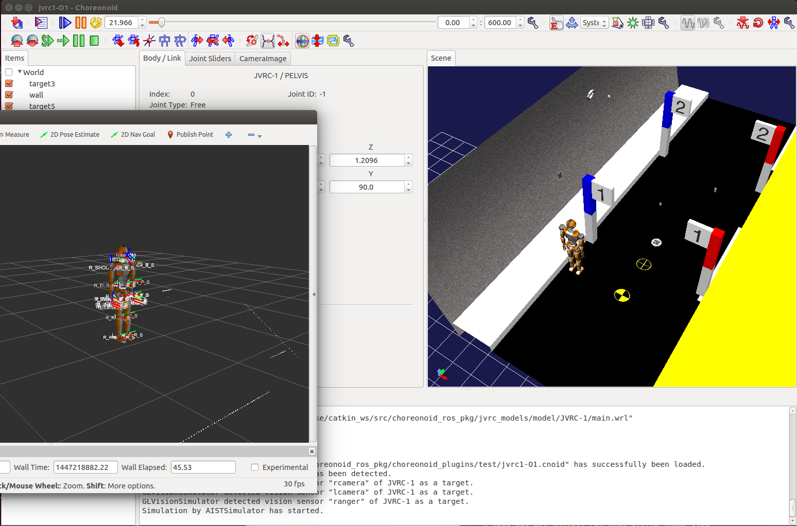
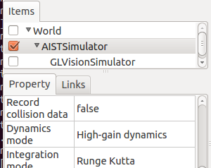

================================
 Choreonoid ROS Plugin Tutorial
================================

Run preconfigured project
=========================

You can use preconfigured project prepared for this tutorial.

.. code-block:: bash
   
   $ roslaunch choreonoid_ros jvrc-1-rviz.launch

You should see the JVRC O1 task loaded on Choreonoid with rviz visualization.

Configure the project by hand
=============================

Or you can prepare project of your own.

To prepare your own project:

1. Create World item and create Body item by opening the robot model data.
2. Configure AISTSimulator item to use High-gain dynamics mode.

3. (Optional) Create and place ViewSimulator item under the AISTSimulator you want to get image input.
4. Create and place BodyRos item under the robot you want to control.
5. Create and place WorldRos item under the world you want to control.

Item view should be structured as follows after the above configuration.

.. image:: itemview.png

Finally, click "start simulation" button to enable the ROS functions.

Use ROS utility commands to monitor the message
===============================================

List available topics:

.. code-block:: bash
   
   $ rostopic list

Print input of force sensor:
   
.. code-block:: bash

   $ rostopic echo /JVRC_1/lfsensor

Display camera input (using image-view package):

.. code-block:: bash
   
   $ sudo apt-get install ros-$ROS_DISTRO-image-view
   $ rosrun image_view image_view image:=/JVRC_1/rcamera/image_raw

Use ROS utility commands to control the simulation
==================================================

Pause the simulation:

.. code-block:: bash

   $ rosservice call /World/pause_physics

Continue the paused simulation:
   
.. code-block:: bash

   $ rosservice call /World/unpause_physics

Use Python script to send command to the robot
==============================================

Following example (test-jointtrajectory-jvrc-1.py) sends each trajectory commands to NECK_Y joint of JVRC-1 robot.

.. literalinclude:: test-jointtrajectory-jvrc-1.py
   :language: python

The script contains under directory of ~/catkin_ws/install/share/choreonoid_plugins/test.

The script you can run in the following procedure.

1. You can use preconfigured project prepared for this tutorial.

.. code-block:: bash

   $ roslaunch choreonoid_ros jvrc-1-rviz.launch

2. Open a new terminal.

3. Run the following command. (If you want to stop the script, please press ctrl + c)

.. code-block:: bash

   $ rosrun choreonoid_plugins test-jointtrajectory-jvrc-1.py

Use Python script to spawn the model
====================================

Following example (test-model-spawn.py) loads box model dynamically to current simulation.

.. literalinclude:: test-model-spawn.py
   :language: python

The script contains under directory of ~/catkin_ws/install/share/choreonoid_plugins/test.

The script you can run in the following procedure.

1. You can use preconfigured project prepared for this tutorial.

.. code-block:: bash

   $ roslaunch choreonoid_ros jvrc-1-rviz.launch

2. Open a new terminal.

3. Run the following command.

.. code-block:: bash

   $ rosrun choreonoid_plugins test-model-spawn.py

